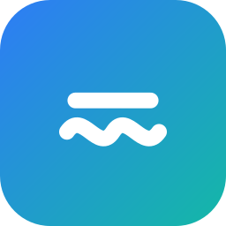

<div align="center">



# Subly+

**Auto-synced `.srt` subtitle overlay for Android video players.**

Pick a subtitle file, start the overlay, and your subtitles are drawn on top of
the video and locked to the player's real playback position — even after you
seek or scrub.


</div>

> ⚠️ Not affiliated with, endorsed by, or connected to Netflix or any streaming
> service. "Netflix" is a trademark of its respective owner.

---

## Features

- 🎯 **Auto-sync** — subtitles lock to the player's real position; seeks snap instantly
- 🪟 **Draws over any app** — works even with `FLAG_SECURE` players (which black out screenshots but not overlays)
- 🎚️ **Fine control** — nudge timing by ±0.1 s; adjustable idle opacity and auto-hide delay
- 🙈 **Context-aware** — the subtitle hides automatically when another app is in the foreground
- 🌗 **Clean dark UI** — near-black theme, English + Turkish
- 🔒 **Private by design** — no account, no ads, no analytics, no network; everything stays on your device

## How it works

Two Android capabilities make this possible (and they are Android-only — this
approach is not possible on iOS):

1. **Overlay window** — a foreground service draws the subtitle text and a small
   floating control in a `TYPE_APPLICATION_OVERLAY` window over other apps
   (`SYSTEM_ALERT_WINDOW` permission). The player uses `FLAG_SECURE`, which
   blocks screenshots but does **not** block an overlay drawn on top.

2. **Position via AccessibilityService** — the player exposes its seek bar in
   the accessibility tree with a `RangeInfo` that reports the absolute playback
   position in milliseconds. An `AccessibilityService` reads it and the app
   locks the subtitle clock to that position. Between reads, a monotonic clock
   interpolates; any seek/scrub snaps the subtitles to the new position.

No DRM is touched and no video is captured — only the app's own text is drawn,
and only the public accessibility position is read.

## Modules

| Module  | What |
|---------|------|
| `:core` | Pure Kotlin/JVM, unit-tested: SRT parsing, charset detection (UTF-8 → Windows-1254 fallback), timeline lookup, the playback clock. |
| `:app`  | Android: the overlay foreground service, the floating control, the accessibility sync service, and the setup screen. |

## Build

Requires JDK 17+ (the Android Studio bundled JBR works well) and the Android SDK.

```bash
# point Gradle at a JDK 17+
export JAVA_HOME="/path/to/jdk-17"

# tell Gradle where your Android SDK is
echo "sdk.dir=/path/to/Android/sdk" > local.properties

# run the unit tests
./gradlew :core:test

# build + install a debug APK on a connected device
./gradlew :app:installDebug
```

- `minSdk 28`, `targetSdk 36`, `compileSdk 36` (AGP 8.9.1 / Gradle 8.11.1).
- Release build: `./gradlew :app:bundleRelease` (R8 enabled). Provide a keystore
  via the `RELEASE_STORE_FILE` / `RELEASE_STORE_PASSWORD` / `RELEASE_KEY_ALIAS` /
  `RELEASE_KEY_PASSWORD` Gradle properties to sign it.

## Using it

1. Open the app, tap **Choose subtitle (.srt)** and pick a file.
2. Tap **Start overlay** — grant the "draw over other apps" permission if asked.
3. Enable the accessibility service when prompted (a disclosure explains why).
4. Play your video — the subtitles lock to the current position and follow along.

The floating control lets you fine-tune timing by ±0.1 s and close the overlay;
the setup screen exposes idle opacity and auto-hide delay.

## A note on the accessibility permission

Subly+ uses an `AccessibilityService` to read the player's playback position.
This is the only way to auto-sync on stock Android. It reads **only** the
seek-bar position of the configured player and sends nothing off the device.

Because this is not a disability-assistance use of the accessibility API, before
the service can be enabled the app shows a prominent in-app disclosure that
explains why and how the API is used and asks for explicit consent. Google Play
distribution requires review and may restrict accessibility-based tools;
sideloading works without any of that. See [docs/privacy.html](docs/privacy.html)
for the full privacy policy.

## License

[MIT](LICENSE) © CyberTKR
